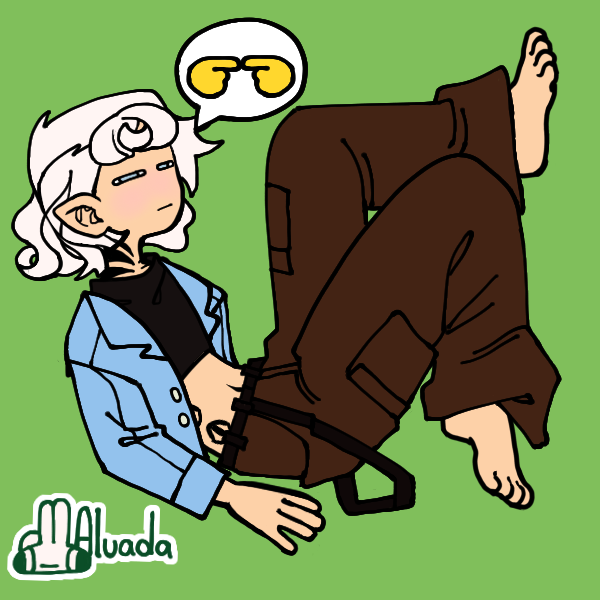

<!--- cSpell:enable --->
# rp stuff idk

## OOC Introduction

* Name: pin
* Age range: 13-15
* Gender: pinmacaroongender or smt idk
* Pronouns: he and they is fine
* Sexuality: bi
* Fun fact: this fact isnt fun

---

## Character Sheet

### Basic Details

* Name (First and last name at least): Zephyr [`last name here idk`]
* Birthday: february 29th
* Nicknames: Zeph
* Gender: male
* Pronouns: he/they
* Age: ~17-18
* Sexuality: bi
* Personality: usually very joyful and sweet. very much cares about their friends in need.
* Backstory: they had a pretty regular childhood, nothing much of note happened, up until one night their parents didnt return home. turns out, they were got into "a car accident" (killed by monsters). they were put into the care of their grandfather, but he didnt care much about them. they started spending their days after school out in the woods, alone. after many years of ||being neglected by their grandpa||, as they were chilling in their hideout, a satyr found them. the satyr explained to him what he is: a demigod. he led them to **𝓒𝓪𝓶𝓹 𝓛𝓐𝓝**...

### Godly Side

* Godly Parent: Zephyrus (God of the west wind and the messenger of spring)
* Weapons: a small sheath knife with a cherry wood handle.
* Powers:
  * **Aerokinesis**
  * manifesting semi solid wings that can be used for short flights (other that that its just there)
  * can give you pollen allergies >:3
* Fatal Flaw: overly people pleaser

### Other Details

* Strengths: they are very agile, and can run fast
* Weaknesses: too hot or too cold weather
* Likes: flowers, lemonade, melodic rock
* Dislikes: too much heat, shouting
* Health conditions:
* Fears: blood, global warming
* Nationality: [`todo`]
* Ethnicity: [`todo`]
* Hobbies: hiking and camping
* Style: [`todo`]
* Scars: none
* FC: 
